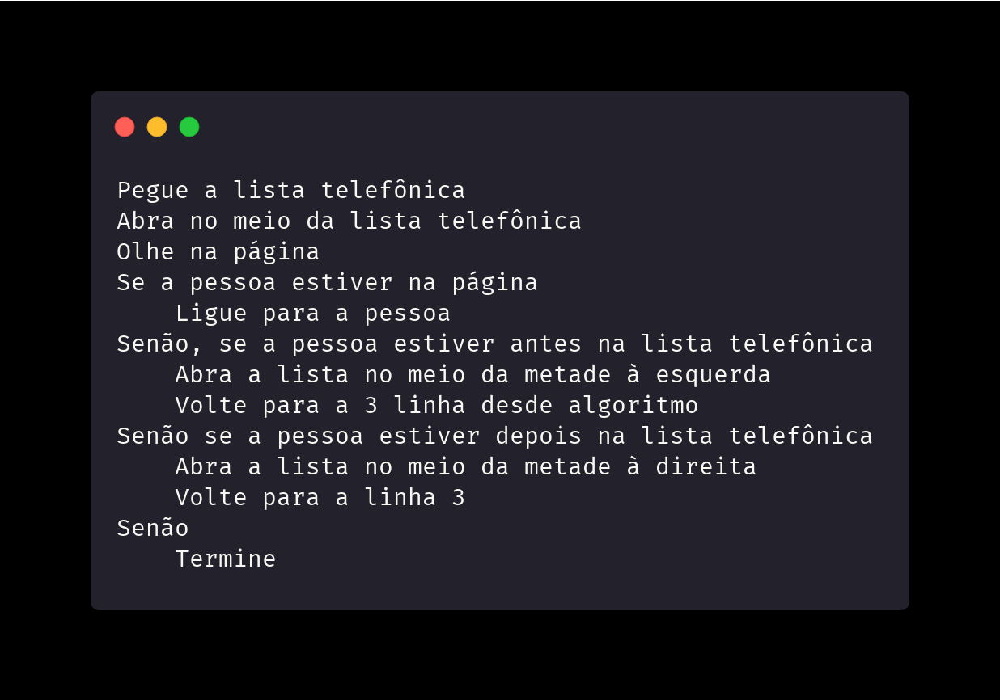

# Week 0

Todo conteúdo desta pasta é baseado [nesta aula](https://cs50.harvard.edu/x/2021/weeks/0/)

## Sobre a Ciência da Computação

> Fundamentalmente, ciência da computação é resolver problemas

A resolução de problemas é um processo que recebe __entradas__ (informações sobre o problema) e gera alguma __saída__ (solução). A caixa preta para isso tudo seria a ciência da computação

## Representação Numérica
Somos ensinados a usar os dedos das mãos para contar quando somos crianças, onde cada digito representa um valor de um.
- Este sistema é o __sistemas unário__

A forma mais eficiente que temos de representar número é através do __sistema decimal__, que contém os dígitos {_0, 1, 2, 3, 4, 5, 6, 7, 8, 9_}

Computadores utilizam o __sistema binário__, que representa os números através de *0*s e *1*s
  - este tipo de interpretação ocorre devido a eletricidade, que, convenientemente, é dual, geralmente representada por 0 (sem corrente) ou 1 (com corrente)
  - Dentro do sistema binário, cada digito é chamado de _bit_ (_**bi**nary **d**igit_)
    - dependendo da quantidade de _bits_ temos várias possibilidades de representação utilizando 0 e 1
  - dentro dos computador existem milhões de transistores que podem ser representados como 0 ou 1
    - Dependendo do contexto, o computador poderá interpretar um valor de forma diferente (exemplo: código da tabela ASCII, sistemas de cores, etc)

## Textos

Uma mensagem de texto escrito "_HI!_" recebe os valores 72, 73 e 33 em binário.
- Geralmente representados por 8 _bits_ (ou 1 _byte_), eles recebem os valors 0100100, 01001001 e 00100001
- 1 _byte_ pode representar 256 valores diferentes, ou 2ˆ8 (menor valor -> 0 e maior valor -> 255)
- A tabela ASCII é baseada no inglês. Outros caracteres podem se obter através do padrão __Unicode__, que utiliza mais bits para acomodar diferentes caracteres
    - Emojis fazem parte do padrão Unicode

## Outras mídias
Uma __imagem__ é feita de cores
- Usando bits, podemos mapear números como cores, sendo o sistema mais comum o RGB, que indica a intensidade de vermelho, verde e azul em cada cor
  - cada número possui 256 valores possíveis, e, combinando-os, podemos representar milhões de cores. Tudo isso com apenas 3 _bytes_
- As imagens são formadas por pixels
  - cada 3 _bytes_ representa a cor de cada um dos pixels de uma imagem
  - a resolução de uma imagem é o número de pixels, horizontais e verticais
    - quanto maior a resolução, mais pixel (e consequentemente, mais _bytes_), serão necessários

Um _vídeo_ é feito por várias imagens que são alteradas várias vezes por segundo, dando uma aparência de movimento, semelhante aos _flipbooks_

_Áudios_ também são representados por _bits_, que mapeam o número de notas e durações, ou a frequência sonora a cada momento do tempo

Formatos de arquivo também são baseados em algum padrão que algumas pessoas construíram para representar determinado tipo de informação com _bits_

## Algoritmos
Algoritmos são instruções passo-a-passo para resolver um problema
- Humanos podem seguir algoritmos, como em receitas culinárias
- Quando programamos, é necessário sermos precisos em nossos algoritmos, senão as instruções podem ser ambíguas ou mal-interpretadas

A eficiência de um algoritmo pode ser medido pelo gráfico abaixo

- quando escrevemos programas, consideramos quão bem planejado ele é, considerando fatores como eficiência

## Pseudocódigo

__Pseudocódigo__ é uma representação de um algoritmo em uma linguagem natural, como o Inglês ou o Português

  - com esses passos, uma pessoa poderá pesquisar por um determinado telefone em uma lista telefônica
  - algumas linhas começam com __verbos de ação__, que poderiam ser chamados de __funções__ (_pegue_, _abra_, _olhe_, _ligue_, _volte_, _termine_)
  - também é possível obter-se __ramos para diferentes caminhos__, como bifurcações em uma rodovia, os quais chamaremos de __condicionais__ (_se_, _senão_)
  - as __questões a serem resolvidas__ são chamadas de __expressões lógicas__, e suas respostas possíveis são apenas sim e não, _true_ ou _false_
  - existem também palavras que criam __ciclos__ (_volte a linha 3_) para repetir trechos do programa chamados **__loops__**

## Scratch
> Nota: como o intuito é me aprofundar em Python e eu conheço o Scratch há muito tempo, saltei este trecho nas anotações. Entretanto, recomendo fortemente a todo iniciante que veja o tópico [neste link](https://cs50.harvard.edu/x/2021/notes/0/#scratch), pois esta ferramenta, desenvolvida pelo MIT, permitirá uma entrada mais leve no mundo da programação